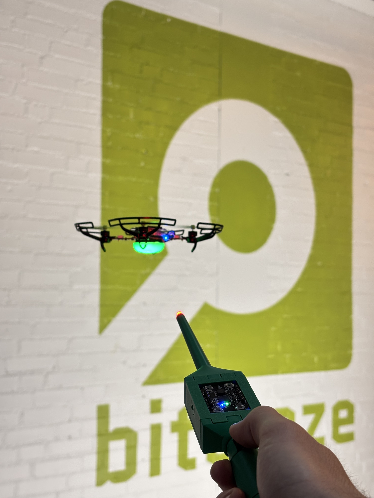

# Crazyflie Lighthouse Wand

A Lighthouse-based device for controlling Crazyflies over P2P communication.

One Crazyflie platform (held in the hand) acts as the **wand** and broadcasts its position and pointing direction over P2P radio. Any number of **receiver** Crazyflies listen and fly to the point on the wand's projected line that they were assigned when they were "grasped".

## Quick start

See [docs/building_and_flashing.md](docs/building_and_flashing.md) for the full building and flashing guide.

See [docs/architecture.md](docs/architecture.md) for the system design and grasping algorithm.