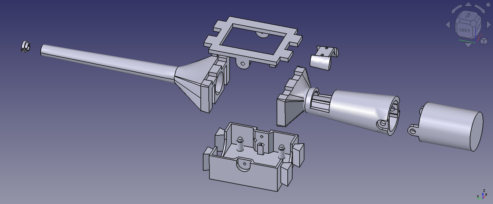

# Hardware

## Electronics

| Component | Notes |
|---|---|
| [Crazyflie Bolt 1.1](https://www.bitcraze.io/products/crazyflie-bolt-1-1/) | Main flight controller|
| [Lighthouse deck](https://www.bitcraze.io/products/lighthouse-positioning-deck/) | Provides Lighthouse positioning |
| Button deck | Custom deck using the [Prototyping deck](https://www.bitcraze.io/products/prototyping-deck/). Acts as an input and provides LED feedback for the button state. |
| [Buzzer deck](https://www.bitcraze.io/products/buzzer-deck/) | Provides sound feedback |

## 3D printed parts

All parts are in [STL/](STL/).

